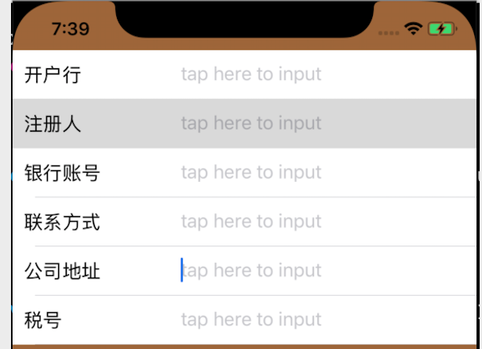

## 写在前面
由于很多 demo 上传之后，可能就不会再维护了，而这些 demo 在 github 上不太需要被检索到，但是会占用一个 repository。为了方便管理，把这些demo都集中放在这里，这里也只是单纯地作为一个存放 demo 的地方。每个demo 都会写一些基本的介绍在下方。

### UITextField 随键盘高度自适应
&emsp;&emsp;在开发APP过程中，不免会遇到页面需要多个 UITextField 的需求，那么问题来了：当输入框过多时，弹起键盘会遮盖住输入框，或者需要依次点击输入框才能输入。用户的输入体验非常差。为解决这个问题，我们让输入框跟随键盘自动调整高度，并且点击回车键自动跳转到下一个输入框进行输入。

   

### Tableview 中包含多个输入框时，该如何优雅地处理？

1.剥离 UI 层，UI层输出固定数据  
2.通过 KVC 使 tableview 的 textField 和 model 的字段形成一一映射，identifier 对应 model 内的字段。  
3.有序数据集和记录tableview cell 的顺序，由于不再需要区分到底哪个输入框的输入对应哪个字段，极大的简化了代码  

  
 

## MYAlertViewController
自定义AlertController
 直接将 MCFAlertController.h 和.m 文件加入工程中即可，可自定义 显示标题颜色。

